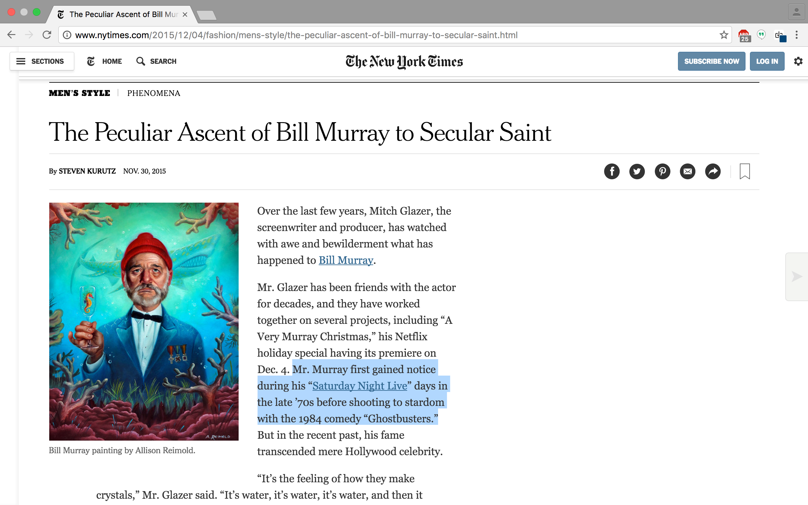
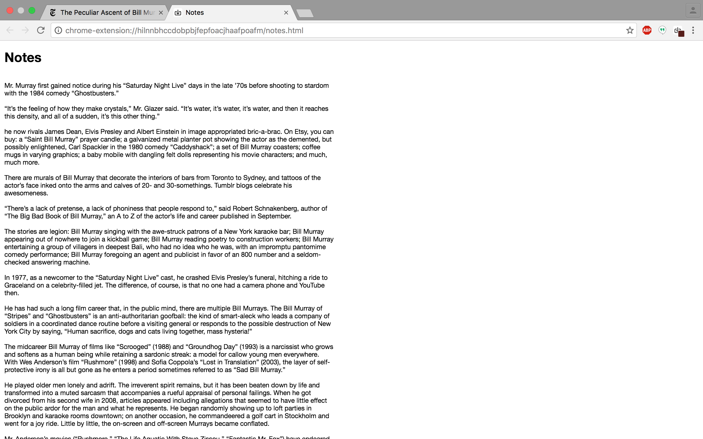

# .save

</img>

[Chrome web store][chrome]

[chrome]: https://chrome.google.com/webstore/detail/save/hilnnbhccdobpbjfepfoacjhaafpoafm

.save is a Chrome extension that allows users to easily save images, files, and text selections from webpages. It was built with Javascript, jQuery, and HTML/CSS.

</img>
</img>
</img>

## Implementation

A [background script][background] handles commands and initiates downloads. A [content script][content] binds the click listeners.

When a user clicks on the page in save mode, first, the target element is checked to be an image. If not, the DOM tree is traversed backwards from the element, searching for a parent with a background image. If not, the DOM tree is traversed backwards from the element, looking for a parent link.

[background]: ./lib/background.js
[content]: ./lib/save.js

```Javascript
document.addEventListener('click', e => {
  chrome.storage.sync.get("saveMode", data => {
    if (data.saveMode){
      const target = e.target;

      if ($(target).is('img')){
        chrome.runtime.sendMessage({url: target.src});
      } else {
        const tree = $.makeArray($(target).parents());
        tree.unshift(target);

        let parentImageUrl;

        tree.some(node => {
          const background = $(node).css('background-image');
          if (background !== 'none'){
            parentImageUrl = background.slice(5, -2);
            return true;
          } else {
            return false;
          }
        });

        if (parentImageUrl){
          chrome.runtime.sendMessage({url: parentImageUrl});
        } else {
          const a = $(target).closest('a')[0];

          if (a){
            chrome.runtime.sendMessage({url: a.href});
          }
        }
      }
    }
  });
});
```
