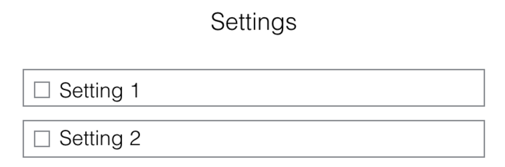

## .save

### Background

.save is a Chrome extension that will facilitate saving text selections, images, and files.

### Functionality & MVP

With this extension, users will be able to:

- [ ] Toggle a save mode with a keyboard shortcut where they can:
- Select text and save it with a single click
- Save images with a single click
- Save files with a single click on their link
- [ ] Two settings: change downloads folder; rename option before save.

### Wireframes

### Technologies & Technical Challenges

This extension will be implemented using the standard Chrome extension technology: Javascript, HTML, and CSS.  In addition to the `manifest.json` and `package.json` files, there will be two scripts:

- `save.js`: will contain the logic for saving file
- `options.js`: will contain the logic for changing the user's settings

There will also be one HTML files to display the content:

- `options.html`: the file that renders the Settings menu for the user

The primary technical challenges will be:

- constructing event handlers that do not interfere with existing ones.

### Implementation Timeline

**Day 1**: Get started on the infrastructure of the extension, following <a href="https://developer.chrome.com/extensions/getstarted">this guide</a> from Chrome.  By the end of the day, I will have:

- A completed `package.json`
- A completed `manifest.json`
- An understanding of how files are saved.

**Day 2**: Save images, files, and text.  By the end of the day, I will have:

- Find a good keyboard shortcut.
- Save anything.

**Day 3**: Settings. By the end of the day:

- Implement rename box.
- Implement change downloads directory.

**Day 4**: CSS.
